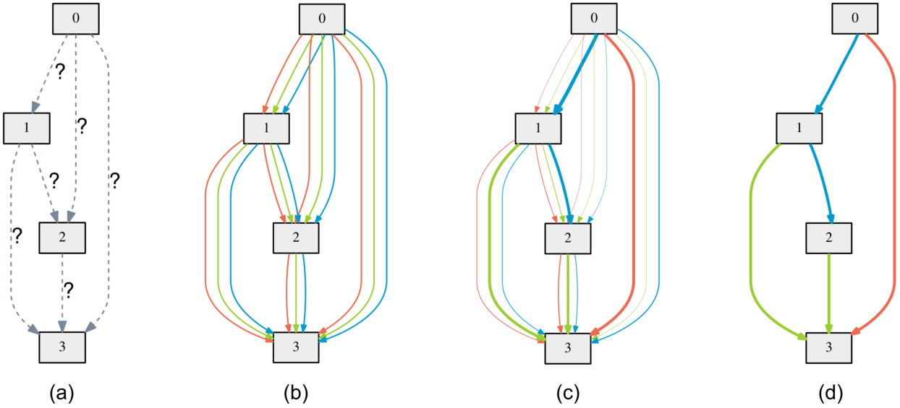
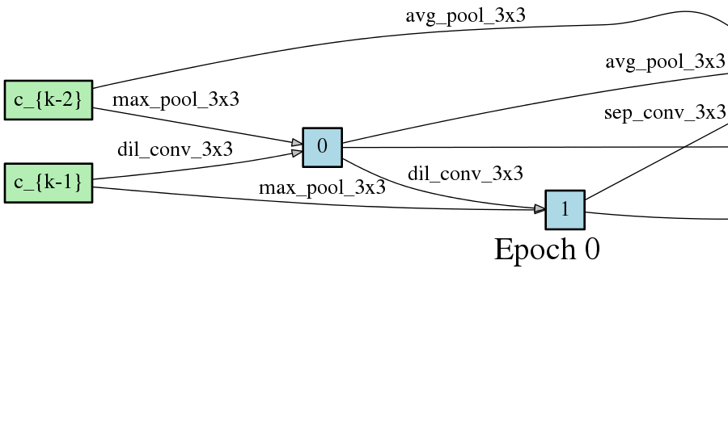
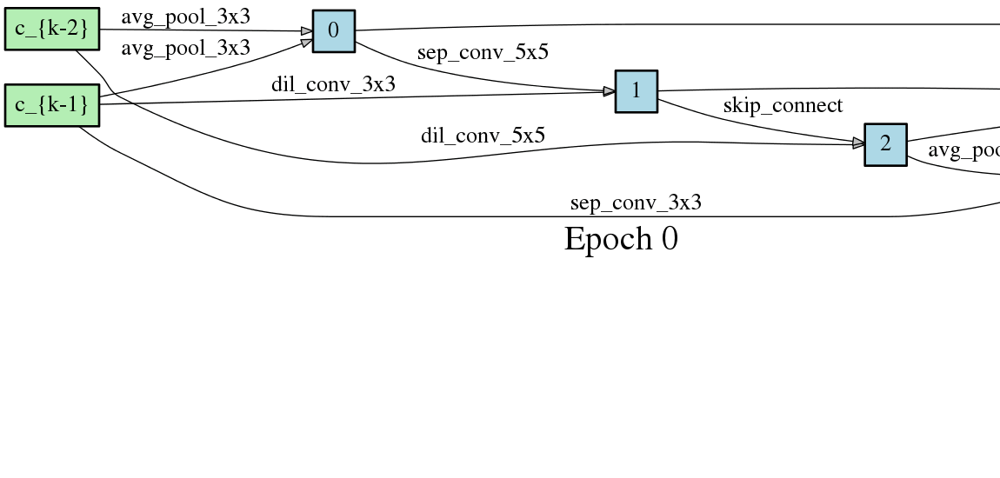
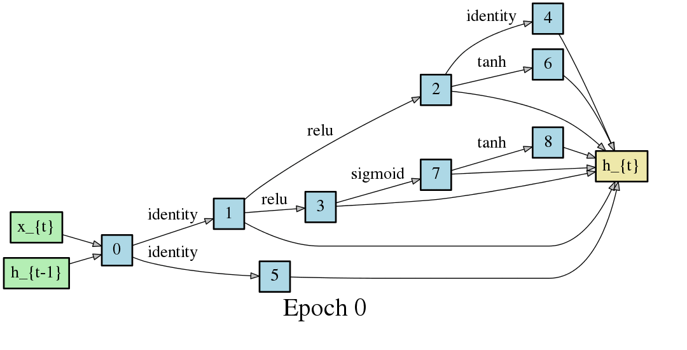
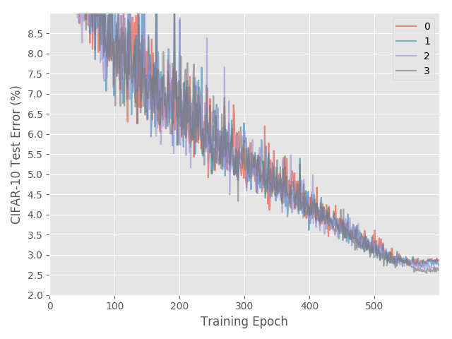
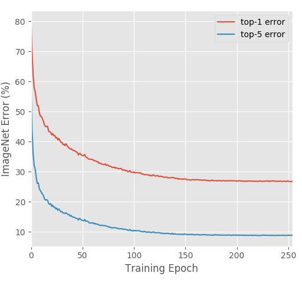
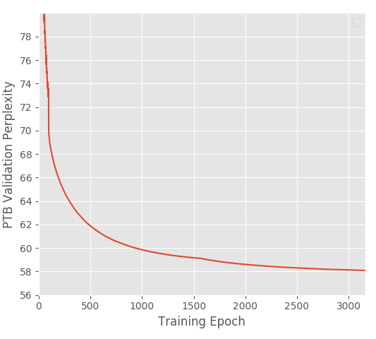

# Differentiable Architecture Search
Code accompanying the paper
> [DARTS: Differentiable Architecture Search](https://arxiv.org/abs/1806.09055)\
> Hanxiao Liu, Karen Simonyan, Yiming Yang.\
> _arXiv:1806.09055_.

<p align="center">
  
</p>
The algorithm is based on continuous relaxation and gradient descent in the architecture space. It is able to efficiently design high-performance convolutional architectures for image classification (on CIFAR-10 and ImageNet) and recurrent architectures for language modeling (on Penn Treebank and WikiText-2). Only a single GPU is required.

## Requirements
```
Python >= 3.5.5, PyTorch == 0.3.1, torchvision == 0.2.0
```
NOTE: PyTorch 0.4 is not supported at this moment and would lead to OOM.

## Datasets
Instructions for acquiring PTB and WT2 can be found [here](https://github.com/salesforce/awd-lstm-lm). While CIFAR-10 can be automatically downloaded by torchvision, ImageNet needs to be manually downloaded (preferably to a SSD) following the instructions [here](https://github.com/pytorch/examples/tree/master/imagenet).

## Pretrained models
The easist way to get started is to evaluate our pretrained DARTS models.

**CIFAR-10** ([cifar10_model.pt](https://drive.google.com/file/d/1Y13i4zKGKgjtWBdC0HWLavjO7wvEiGOc/view?usp=sharing))
```
cd cnn && python test.py --auxiliary --model_path cifar10_model.pt
```
* Expected result: 2.63% test error rate with 3.3M model params.

**PTB** ([ptb_model.pt](https://drive.google.com/file/d/1Mt_o6fZOlG-VDF3Q5ModgnAJ9W6f_av2/view?usp=sharing))
```
cd rnn && python test.py --model_path ptb_model.pt
```
* Expected result: 55.68 test perplexity with 23M model params.

**ImageNet** ([imagenet_model.pt](https://drive.google.com/file/d/1AKr6Y_PoYj7j0Upggyzc26W0RVdg4CVX/view?usp=sharing))
```
cd cnn && python test_imagenet.py --auxiliary --model_path imagenet_model.pt
```
* Expected result: 26.7% top-1 error and 8.7% top-5 error with 4.7M model params.

## Architecture search (using small proxy models)
To carry out architecture search using 2nd-order approximation, run
```
cd cnn && python train_search.py --unrolled     # for conv cells on CIFAR-10
cd rnn && python train_search.py --unrolled     # for recurrent cells on PTB
```
Note the _validation performance in this step does not indicate the final performance of the architecture_. One must train the obtained genotype/architecture from scratch using full-sized models, as described in the next section.

Also be aware that different runs would end up with different local minimum. To get the best result, it is crucial to repeat the search process with different seeds and select the best cell(s) based on validation performance (obtained by training the derived cell from scratch for a small number of epochs). Please refer to fig. 3 and sect. 3.2 in our arXiv paper.

<p align="center">



</p>
<p align="center">
Figure: Snapshots of the most likely normal conv, reduction conv, and recurrent cells over time.
</p>

## Architecture evaluation (using full-sized models)
To evaluate our best cells by training from scratch, run
```
cd cnn && python train.py --auxiliary --cutout            # CIFAR-10
cd rnn && python train.py                                 # PTB
cd rnn && python train.py --data ../data/wikitext-2 \     # WT2
            --dropouth 0.15 --emsize 700 --nhidlast 700 --nhid 700 --wdecay 5e-7
cd cnn && python train_imagenet.py --auxiliary            # ImageNet
```
Customized architectures are supported through the `--arch` flag once specified in `genotypes.py`.

The CIFAR-10 result at the end of training is subject to variance due to the non-determinism of cuDNN back-prop kernels. _It would be misleading to report the result of only a single run_. By training our best cell from scratch, one should expect the average test error of 10 independent runs to fall in the range of 2.76 +/- 0.09% with high probability.

<p align="center">



</p>
<p align="center">
Figure: Expected learning curves on CIFAR-10 (4 runs), ImageNet and PTB.
</p>

## Visualization
Package [graphviz](https://graphviz.readthedocs.io/en/stable/index.html) is required to visualize the learned cells
```
python visualize.py DARTS
```
where `DARTS` can be replaced by any customized architectures in `genotypes.py`.

## Citation
If you use any part of this code in your research, please cite our [paper](https://arxiv.org/abs/1806.09055):
```
@article{liu2018darts,
  title={DARTS: Differentiable Architecture Search},
  author={Liu, Hanxiao and Simonyan, Karen and Yang, Yiming},
  journal={arXiv preprint arXiv:1806.09055},
  year={2018}
}
```
