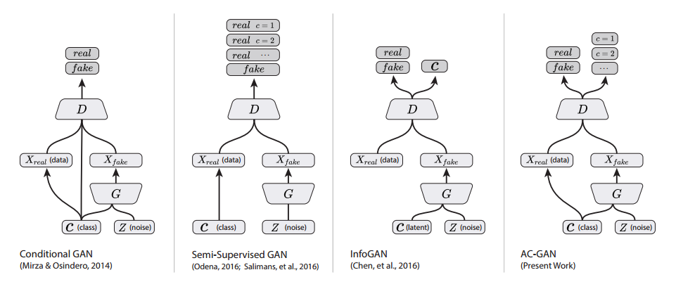
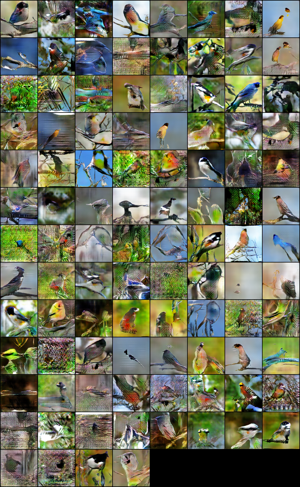
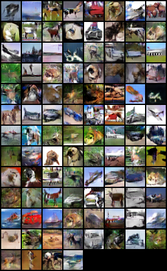

# 基本上直接运行就行,好像没什么bug

做出来的效果,cifar10还行的吧,不知道为什么效果偏黑

---
# Conditional Image Synthesis With Auxiliary Classifier GANs

As part of the implementation series of [Joseph Lim's group at USC](http://csail.mit.edu/~lim), our motivation is to accelerate (or sometimes delay) research in the AI community by promoting open-source projects. To this end, we implement state-of-the-art research papers, and publicly share them with concise reports. Please visit our [group github site](https://github.com/gitlimlab) for other projects.

This project is implemented by [Te-Lin Wu](https://github.com/telin0411) and the codes have been reviewed by [Shao-Hua Sun](https://github.com/shaohua0116) before being published.

## Descriptions
This project is a [PyTorch](http://pytorch.org) implementation of [Conditional Image Synthesis With Auxiliary Classifier GANs](https://arxiv.org/abs/1610.09585) which was published as a conference proceeding at ICML 2017. This paper proposes a simple extention of GANs that employs label conditioning in additional to produce high resolution and high quality generated images. 

By adding an auxiliary classifier to the discriminator of a GAN, the discriminator produces not only a probability distribution over sources but also probability distribution over the class labels. This simple modification to the standard DCGAN models does not give tremendous difference but produces better results and is capable of stabilizing the whole adversarial training.

The architecture is as shown below for comparisons of several GANs.
<p align="center">
    
</p>

The sample generated images from ImageNet dataset.
<p align="center">
    
</p>

The sample generated images from CIFAR-10 dataset.
<p align="center">
    
</p>

The implemented model can be trained on both [CIFAR-10](https://www.cs.toronto.edu/~kriz/cifar.html) and [ImageNet](http://www.image-net.org) datasets. 

Note that this implementation may differ in details from the original paper such as model architectures, hyperparameters, applied optimizer, etc. while maintaining the main proposed idea.

\*This code is still being developed and subject to change.

## Prerequisites

- Python 2.7
- [PyTorch](http://pytorch.org)
- [SciPy](http://www.scipy.org/install.html)
- [NumPy](http://www.numpy.org/)
- [PIL](http://pillow.readthedocs.io/en/3.1.x/installation.html)
- [imageio](https://imageio.github.io/)

## Usage
Run the following command for details of each arguments.
```bash
$ python main.py -h
```
You should specify the path to the dataset you are using with argument --dataroot, the code will automatically check if you have cifar10 dataset downloaded or not. If not, the code will download it for you. For the ImageNet training you should download the whole dataset on their website, this repository used 2012 version for the training. And you should point the dataroot to the train (or val) directory as the root directory for ImageNet training.

In line 80 of main.py, you can change the classes\_idx argument to take into other user-specified imagenet classes, and adjust the num\_classes accordingly if it is not 10.
```python
if opt.dataset == 'imagenet':
    # folder dataset
    dataset = ImageFolder(root=opt.dataroot,
                          transform=transforms.Compose([
                              transforms.Scale(opt.imageSize),
                              transforms.CenterCrop(opt.imageSize),
                              transforms.ToTensor(),
                              transforms.Normalize((0.5, 0.5, 0.5), (0.5, 0.5, 0.5)),
                         ]),
                         classes_idx=(10,20))
```

### Train the models
Example training commands, the code will automatically generate images for testing during training to the --outf directory.
```bash
$ python main.py --outf=/your/output/file/name --niter=500 --batchSize=100 --cuda --dataset=cifar10 --imageSize=32 --dataroot=/data/path/to/cifar10 --gpu=0
```

## Author

Te-Lin Wu / [@telin0411](https://github.com/telin0411) @ [Joseph Lim's research lab](https://github.com/gitlimlab) @ USC
