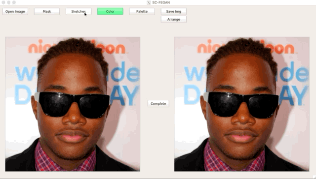
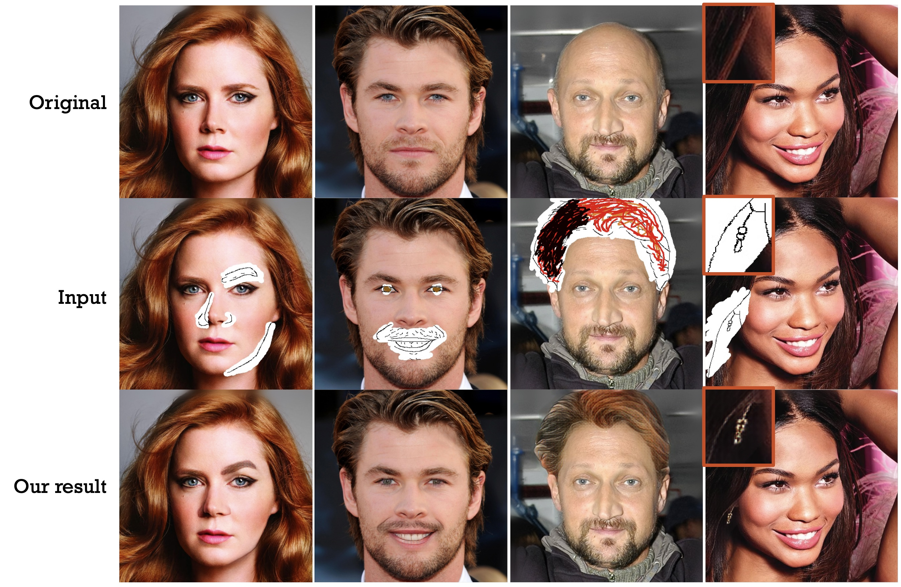
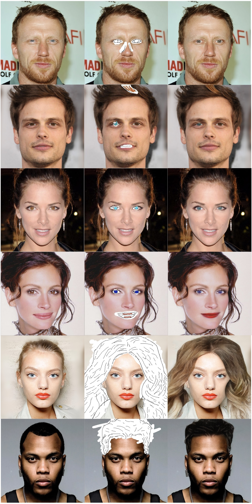
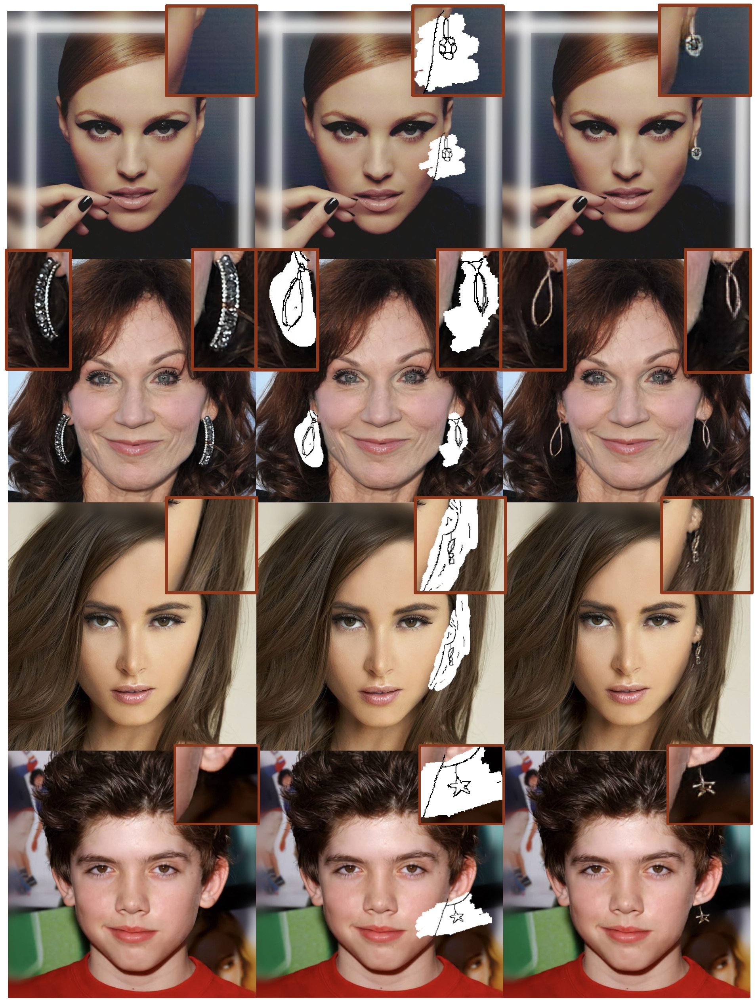
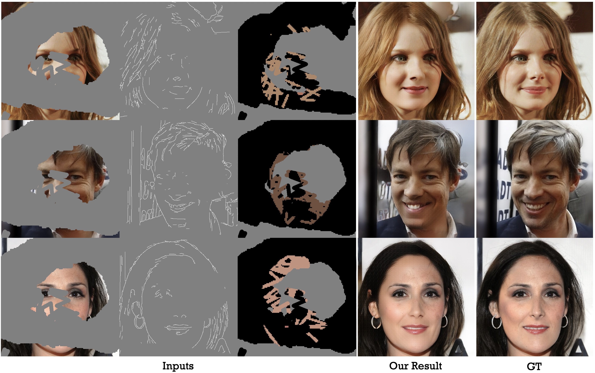
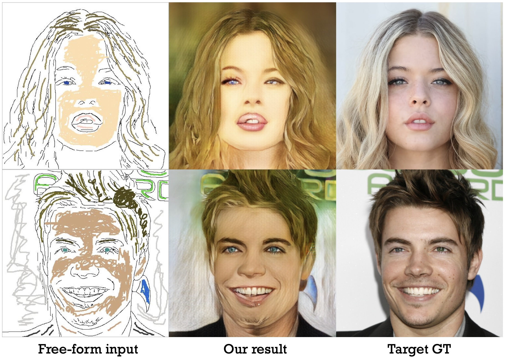

# SC-FEGAN
SC-FEGAN : Face Editing Generative Adversarial Network with User's Sketch and Color

Youngjoo Jo, Jongyoul Park

arXiv: [https://arxiv.org/abs/1902.06838](https://arxiv.org/abs/1902.06838)



## Overview
We learn to edit face image with a deep network. Our network SC-FEGAN is well suited to generate high quality synthetic image using intuitive user inputs with sketch and color. We used SN-patchGAN discriminator and Unet-like generator with gated convolutional layers.



## Dependencies
- tensorflow
- numpy
- Python3
- PyQt5
- opencv-python
- pyyaml

## Usage
First, download the model from [Google drive](https://drive.google.com/open?id=1VPsYuIK_DY3Gw07LEjUhg2LwbEDlFpq1).

Basic usage is:
  ```
  mv /${HOME}/SC-FEGAN.ckpt.* /${HOME}/ckpt/
  python3 demo.py
  ```
  
Select the number of GPU by editing `demo.yaml` file (not support multi-GPUs).
  ```
  GPU_NUM: 1 (the number you want to use)
  #GPU_NUM: (if you want to use only CPU, erase the number)
  ```
  
You can use our network with simple GUI. The only erased regions are filled.

The buttons in GUI:

- `Open Image`: Open the image you want to edit and reset sketch and color.
- `Mask`: Click this button and draw the mask on the left viewer.
- `Sketches`: Click this button and draw the line for sketch on the left viewer.
- `Color`: Click this button and draw the line for color. If you click this first time, you have to choose the color from palette.
- `Palette`: Click this button to change color. If you choose the color, then click the `Color` button to change.
- `Save Img`: Click this button to save results. It is saved as '*name.jpg*'.
- `Arrange`: Arrange the editing works.
- `Undo`: Undo previous editing work.
- `Complete`: Complete the image and show it on the right.

  
We recommend using this in the following steps:
  ```
  1. Draw the sketch plausibly referring to the original image.
  2. Draw the mask on the sketched region.
  3. Click the `Arrange` button.
  4. Draw the color on the masked region.
  5. Click `Complete'.
  ```  

## Example Results
### Face editing


### Edit earring


### Face restoration


### Face restoration (with only sketch and color)


## License
CC 4.0 Attribution-NonCommercial International

The software is for educational and academic research purpose only.

## Notes

- This is developed on Linux machine running Ubuntu 18.04.1
- Provided model and sample code is under a non-commercial creative commons license.

## Citing
```
@article{jo2019sc,
  title={SC-FEGAN: Face Editing Generative Adversarial Network with User's Sketch and Color},
  author={Jo, Youngjoo and Park, Jongyoul},
  journal={arXiv preprint arXiv:1902.06838},
  year={2019}
}
```

## Next
- Update training code

